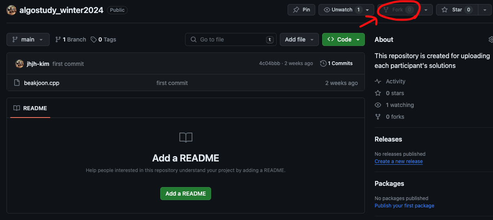
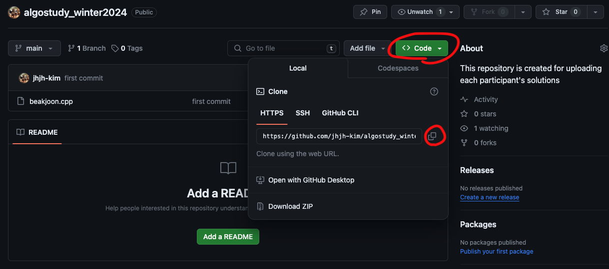
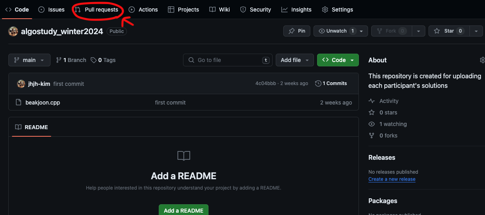

## Algorithm & Codling Test Problem Solving Challenge!

### 참여 방법
1. 우측 상단의 fork 버튼 클릭

 
2. 본인 repository에 스터디 repository가 동일하게 존재하는지 확인
 
3. <> Code 버튼을 클릭해 해당 repository의 url을 복사

 
4. 명령프롬프트 or 터미널 open
5. 해당 repository를 저장할 위치로 cd
6. 해당 경로에서 "git clone [방금복사한url]" 실행
   - 원격 repository에 저장돼 있던 폴더가 본인의 로컬 폴더로 복사됨
 
### 원하는 경로에서 파일 업로드 방법
   1. 원하는 경로로 cd 
   2. 파일 staging
      -  파일 하나: "git add 파일이름.확장자"
      -  해당 위치 모든 파일: "git add ."
   3. 잘 등록됐는지 확인: "git status"
   4. 잘 등록 됐으면 commit: git commit -m "커밋메세지"
   5. fork한 원격 repository에 파일 업로드: "git push origin main"
 
### 원본 repository에 수정사항 반영 방법
1. 본인 깃허브 repository 페이지 접속
2. 좌측 상단의 "Pull requests" 버튼 클릭

3. "New pull request" 버튼 클릭
4. "Create pull request" 버튼 클릭
5. Pull request 제목과 내용 작성 후 "Create pull request" 버튼 클릭

### 원본 repository의 수정사항 자신의 fork된 repository에 반영 방법
1. "Fetch and merge" 버튼 클릭

 

### commit 메세지 Rule
1. "[BOJ]문제번호/문제난이도" 형태로 작성
   - 문제난이도 표기법: 알파벳소문자+숫자
   - ex) git commit -m "[BOJ]20127/gold5"
  